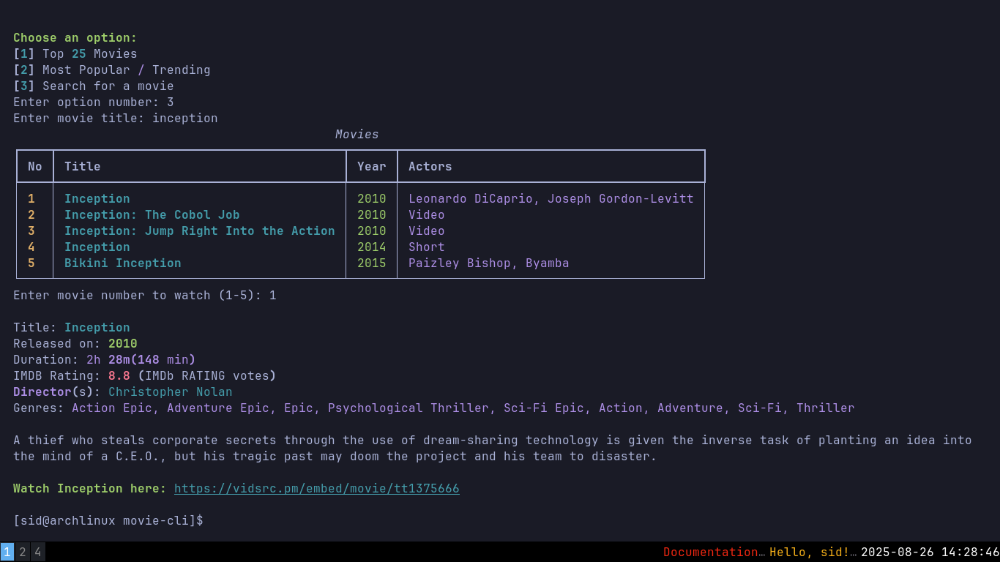

# movie-cli

A Python app to fetch, explore and watch movies from the terminal.

---

</img>

## Features

* View **Top 25 movies** 🍿
* See **Most Popular / Trending** movies 🔥
* **Search** for any movie 🎯
* Get detailed info: release year, duration, rating, directors, genres, and plot 📖
* Returns **direct links** to watch the desired movies ▶️

---

## Installation

1. Clone the repo:

```bash
git clone https://github.com/lamsal27/movie-cli.git
cd movie-cli
```

2. Install dependencies:

```bash
pip install typer requests beautifulsoup4 rich
```

---

## Usage

Run the app:

```bash
python main.py
```

Follow the prompts to browse or search for movies.

---

## Notes

* Requires an internet connection 🌐
* Uses IMDb pages to fetch movie details
* Terminal-friendly display using Rich
* Provides direct links to watch selected movies online

---

Made with ❤️ by [lamsal27](https://github.com/lamsal27)

